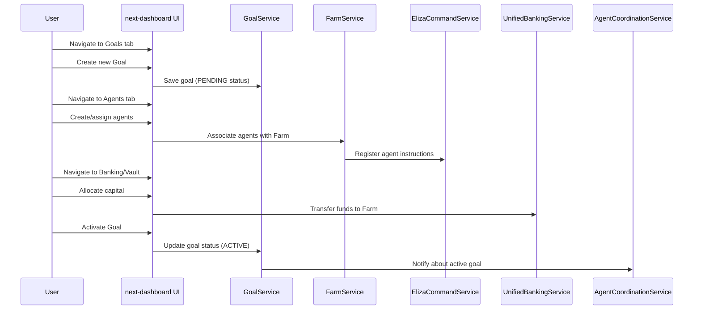
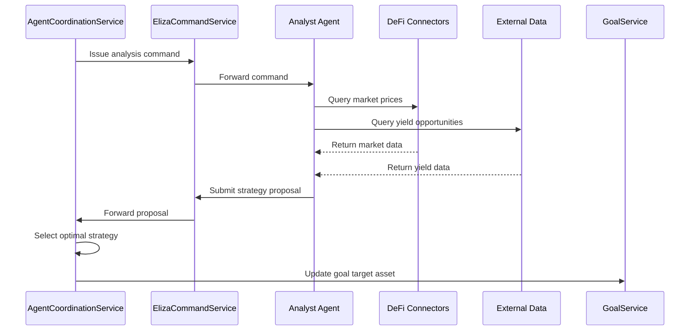
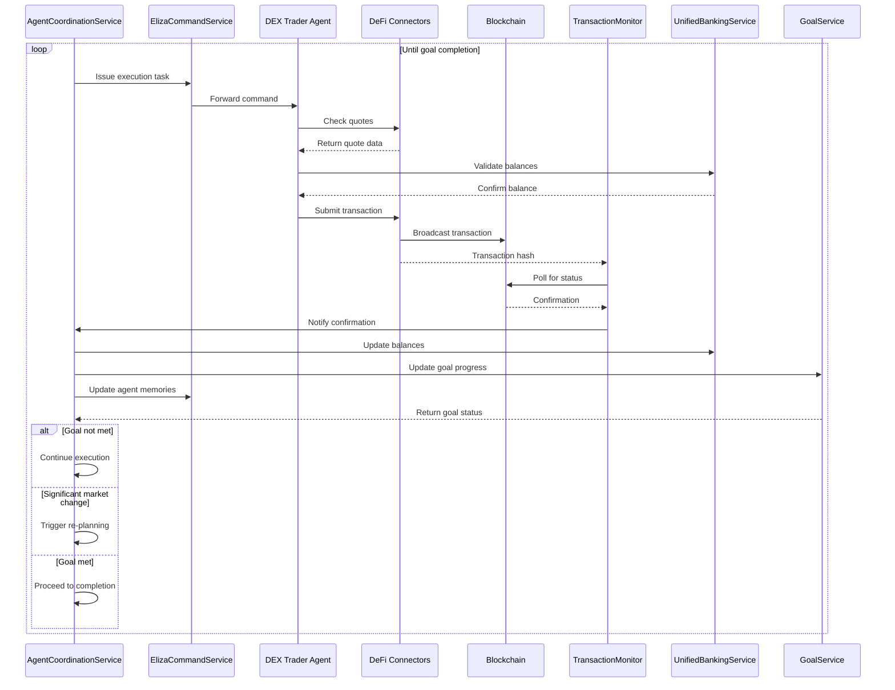
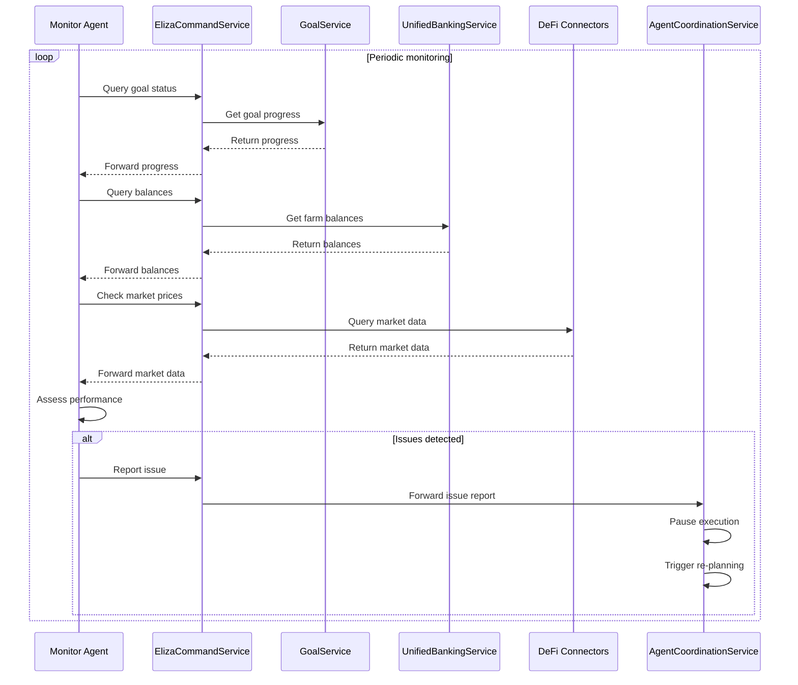
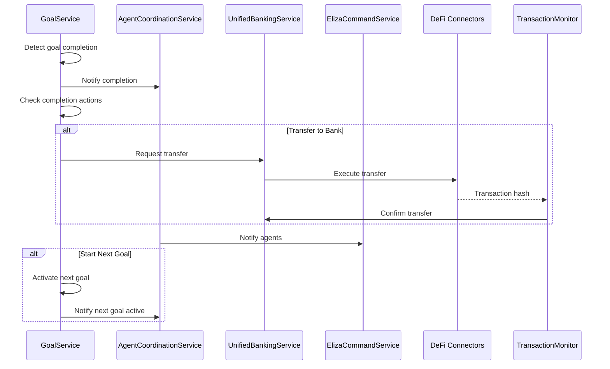

# Farm Goal Acquisition Workflow

This document outlines the complete workflow for a Farm to achieve cryptocurrency acquisition goals (10,000 SONIC or 10,000 SUI tokens) using the Trading Farm system architecture.

## Overview

The goal acquisition workflow orchestrates multiple components of the Trading Farm platform to:
1. Define and track specific acquisition goals (e.g., accumulate 10,000 SONIC or 10,000 SUI)
2. Coordinate agents to analyze, plan, and execute strategies 
3. Manage funds and transactions between vault accounts
4. Monitor progress and adapt to changing market conditions
5. Complete goals and potentially trigger follow-up actions

## Core Components

| Component | Description | Status |
|-----------|-------------|--------|
| FarmService | Manages farm creation, agent/wallet association | Existing |
| GoalService | Defines, tracks, and manages completion logic for goals | New |
| UnifiedBankingService | Manages internal fund allocation and transfers | Existing |
| AgentCoordinationService | Orchestrates agents working towards the goal | New |
| ElizaCommandService | Enables agents to receive tasks, execute actions, and store memories | Existing |
| DeFi Connectors | Interact with specific DeFi protocols | Existing |
| TransactionMonitor | Tracks on-chain transaction status | Existing |
| next-dashboard UI | User interface for setup, monitoring, and control | Existing |

## Workflow Phases

### Phase 1: Setup & Initialization



#### Detailed Steps:

1. **User Defines Goal (UI -> GoalService):**
   - User navigates to the "Goals" tab in the next-dashboard
   - User creates a new Goal with:
     - Name: "Acquire 10k SONIC or SUI"
     - Target Amount: 10000
     - Target Asset: ["SONIC", "SUI"] (indicates a choice)
     - Farm ID: Select the target Farm
     - Completion Actions: Define what happens on completion (e.g., transfer to Bank Account, start next goal)
   - GoalService saves the goal to the database, initially in 'PENDING' or 'INACTIVE' status

2. **User Assigns/Creates Agents (UI -> FarmService/ElizaCommandService):**
   - User navigates to the "Agents" tab
   - User creates new ElizaOS agents (e.g., Market Analyst, DEX Trader, Yield Seeker) or assigns existing ones
   - User associates these agents with the target Farm via FarmService

3. **User Allocates Capital (UI -> UnifiedBankingService):**
   - User navigates to the Banking/Vault section
   - User allocates initial capital (e.g., USDC, SUI) from a Master Vault to the Farm's primary operational VaultAccount
   - UnifiedBankingService records this internal transfer

4. **User Activates Goal (UI -> GoalService):**
   - User activates the "Acquire 10k SONIC or SUI" goal
   - GoalService marks the goal as 'ACTIVE' and notifies AgentCoordinationService

### Phase 2: Planning & Strategy



#### Detailed Steps:

1. **Coordinator Assigns Goal (AgentCoordinationService -> ElizaCommandService):**
   - AgentCoordinationService receives the 'ACTIVE' goal notification
   - It identifies the agents assigned to the farm
   - It sends commands via ElizaCommandService to relevant agents (e.g., Analyst Agent): "Analyze feasibility and best strategy to acquire 10,000 SONIC or 10,000 SUI with current farm resources"

2. **Agents Analyze (ElizaCommandService -> DeFi Connectors/External Data):**
   - Analyst Agent receives the command
   - It uses DeFi Connectors to fetch current market prices for SONIC, SUI, and potential intermediate assets
   - It might query external data sources for yield opportunities related to SONIC/SUI
   - It evaluates the cost/effort to acquire 10k of each target asset considering: current price, liquidity, potential slippage, available yield strategies

3. **Agents Propose Strategy (ElizaCommandService -> AgentCoordinationService):**
   - Analyst Agent formulates a recommendation:
     - "Target SUI acquisition via swapping USDC on Cetus DEX. Estimated cost: X USDC."
     - OR "Target SONIC acquisition via yield farming protocol Y. Estimated time: Z days."
   - Agent sends this proposal back to the AgentCoordinationService via ElizaCommandService

4. **Coordinator Selects Strategy (AgentCoordinationService):**
   - AgentCoordinationService receives proposals
   - It applies logic (or potentially requests user confirmation via UI) to select the primary target (e.g., SUI) and the initial strategy (e.g., DEX Swapping)
   - It updates the Goal's internal state (if needed) to reflect the chosen target asset (SUI)

### Phase 3: Execution Loop



#### Detailed Steps:

1. **Coordinator Issues Execution Task (AgentCoordinationService -> ElizaCommandService):**
   - AgentCoordinationService instructs the relevant Execution Agent (e.g., DEX Trader): "Execute swap of N USDC for SUI on Cetus, aiming for best price. Max slippage 0.5%."

2. **Agent Prepares Transaction (ElizaCommandService -> DeFi Connectors):**
   - DEX Trader Agent receives the command
   - It uses the DeFi Connector for Cetus (or relevant DEX for SUI/SONIC):
     - Checks current quotes
     - Determines parameters for the swap transaction
     - Validates against farm balance (UnifiedBankingService check) and agent permissions

3. **Agent Executes On-Chain (DeFi Connectors -> Blockchain -> TransactionMonitor):**
   - DeFi Connector constructs and submits the transaction to the relevant testnet (e.g., SUI Testnet)
   - The transaction hash is captured and passed to the TransactionMonitor

4. **Monitor Tracks Confirmation (TransactionMonitor -> AgentCoordinationService):**
   - TransactionMonitor polls the testnet for the transaction status
   - On confirmation (or failure), it notifies the AgentCoordinationService

5. **Update Internal State (AgentCoordinationService -> UnifiedBankingService / GoalService):**
   - On successful confirmation:
     - AgentCoordinationService instructs UnifiedBankingService to update the Farm's VaultAccount balances (decrease USDC, increase SUI)
     - AgentCoordinationService instructs GoalService to update the currentAmount for the active goal based on the SUI received
     - Relevant Agents update their memory (ElizaCommandService)

6. **Loop/Re-evaluate:**
   - The AgentCoordinationService determines the next action:
     - If the goal is not met, continue issuing swap tasks (return to step 1)
     - If market conditions change significantly (detected by Monitoring workflow), trigger re-planning
     - If the goal is met, proceed to Completion Workflow

### Phase 4: Monitoring & Adaptation (Concurrent)



#### Detailed Steps:

1. **Agents Monitor Progress (ElizaCommandService -> GoalService/UnifiedBankingService):**
   - Monitoring agents periodically query GoalService for goal progress (currentAmount vs targetAmount)
   - They query UnifiedBankingService for current farm balances

2. **Agents Monitor Markets (ElizaCommandService -> DeFi Connectors):**
   - Analyst agents periodically check market prices and liquidity relevant to the current strategy (e.g., USDC/SUI price)

3. **Agents Assess Performance (ElizaCommandService):**
   - Agents evaluate the effectiveness of the current strategy (e.g., average swap price vs. market, progress rate)

4. **Trigger Adaptation (AgentCoordinationService):**
   - If monitoring detects issues (stalled progress, high slippage, better opportunity for the other target asset - SONIC), an agent notifies AgentCoordinationService
   - AgentCoordinationService pauses the current execution and triggers a return to the Planning & Strategy Workflow (Phase 2) to re-evaluate and potentially switch targets or strategies

### Phase 5: Goal Completion



#### Detailed Steps:

1. **Goal Reached (GoalService):**
   - During the Execution Loop update (Phase 3, Step 5), GoalService detects that currentAmount >= targetAmount (e.g., Farm now holds >= 10,000 SUI)

2. **Mark Goal Complete (GoalService -> AgentCoordinationService):**
   - GoalService updates the goal status to 'COMPLETED'
   - It notifies AgentCoordinationService

3. **Execute Completion Actions (GoalService -> UnifiedBankingService):**
   - GoalService checks the completionActions defined for the goal
   - If "transferToBank" is true:
     - It calculates the amount to transfer (e.g., 10,000 SUI)
     - It instructs UnifiedBankingService to initiate a transfer from the Farm's operational VaultAccount to the designated "Bank" VaultAccount

4. **Notify Agents (AgentCoordinationService -> ElizaCommandService):**
   - AgentCoordinationService informs the relevant farm agents that the goal is complete

5. **Initiate Next Goal (GoalService / AgentCoordinationService):**
   - If "startNextGoal" is true and a nextGoalId is defined in the completed goal, GoalService activates the next goal, restarting the cycle from Phase 1, Step 4

## Implementation Requirements

### Database Schema Additions

```sql
-- Goal-related tables
CREATE TABLE public.goals (
    id UUID PRIMARY KEY DEFAULT uuid_generate_v4(),
    farm_id UUID REFERENCES public.farms(id) NOT NULL,
    name TEXT NOT NULL,
    description TEXT,
    target_amount NUMERIC NOT NULL,
    current_amount NUMERIC DEFAULT 0,
    target_assets TEXT[] NOT NULL, -- Can contain multiple options like ['SONIC', 'SUI']
    selected_asset TEXT, -- Will be set during strategy selection
    status TEXT NOT NULL CHECK (status IN ('PENDING', 'ACTIVE', 'PAUSED', 'COMPLETED', 'FAILED')),
    completion_actions JSONB, -- { transferToBank: true, startNextGoal: false, nextGoalId: null }
    created_at TIMESTAMP WITH TIME ZONE DEFAULT now(),
    updated_at TIMESTAMP WITH TIME ZONE DEFAULT now()
);

CREATE TABLE public.goal_strategies (
    id UUID PRIMARY KEY DEFAULT uuid_generate_v4(),
    goal_id UUID REFERENCES public.goals(id) NOT NULL,
    agent_id UUID REFERENCES public.agents(id) NOT NULL,
    strategy_type TEXT NOT NULL, -- e.g., 'DEX_SWAP', 'YIELD_FARMING'
    parameters JSONB,
    is_active BOOLEAN DEFAULT false,
    proposed_at TIMESTAMP WITH TIME ZONE DEFAULT now(),
    selected_at TIMESTAMP WITH TIME ZONE,
    created_at TIMESTAMP WITH TIME ZONE DEFAULT now(),
    updated_at TIMESTAMP WITH TIME ZONE DEFAULT now()
);

CREATE TABLE public.goal_transactions (
    id UUID PRIMARY KEY DEFAULT uuid_generate_v4(),
    goal_id UUID REFERENCES public.goals(id) NOT NULL,
    strategy_id UUID REFERENCES public.goal_strategies(id),
    transaction_type TEXT NOT NULL, -- e.g., 'SWAP', 'STAKE', 'UNSTAKE', 'CLAIM'
    asset_from TEXT,
    amount_from NUMERIC,
    asset_to TEXT,
    amount_to NUMERIC,
    transaction_hash TEXT,
    status TEXT NOT NULL CHECK (status IN ('PENDING', 'CONFIRMED', 'FAILED')),
    created_at TIMESTAMP WITH TIME ZONE DEFAULT now(),
    updated_at TIMESTAMP WITH TIME ZONE DEFAULT now()
);

-- Create triggers for created_at and updated_at
CREATE TRIGGER handle_updated_at BEFORE UPDATE ON public.goals
    FOR EACH ROW EXECUTE FUNCTION public.handle_updated_at();

CREATE TRIGGER handle_updated_at BEFORE UPDATE ON public.goal_strategies
    FOR EACH ROW EXECUTE FUNCTION public.handle_updated_at();

CREATE TRIGGER handle_updated_at BEFORE UPDATE ON public.goal_transactions
    FOR EACH ROW EXECUTE FUNCTION public.handle_updated_at();

-- Enable RLS for all tables
ALTER TABLE public.goals ENABLE ROW LEVEL SECURITY;
ALTER TABLE public.goal_strategies ENABLE ROW LEVEL SECURITY;
ALTER TABLE public.goal_transactions ENABLE ROW LEVEL SECURITY;

-- Create policies for RLS
CREATE POLICY "Users can view their own goals" ON public.goals
    FOR SELECT USING (farm_id IN (SELECT id FROM public.farms WHERE user_id = auth.uid()));

CREATE POLICY "Users can insert their own goals" ON public.goals
    FOR INSERT WITH CHECK (farm_id IN (SELECT id FROM public.farms WHERE user_id = auth.uid()));

CREATE POLICY "Users can update their own goals" ON public.goals
    FOR UPDATE USING (farm_id IN (SELECT id FROM public.farms WHERE user_id = auth.uid()));

-- Similar policies for goal_strategies and goal_transactions
```

### API Endpoints

#### GoalService API

```typescript
// GoalService.ts interfaces
interface GoalCreate {
  farmId: string;
  name: string;
  description?: string;
  targetAmount: number;
  targetAssets: string[];
  completionActions?: {
    transferToBank?: boolean;
    startNextGoal?: boolean;
    nextGoalId?: string;
  };
}

interface Goal extends GoalCreate {
  id: string;
  currentAmount: number;
  selectedAsset?: string;
  status: 'PENDING' | 'ACTIVE' | 'PAUSED' | 'COMPLETED' | 'FAILED';
  createdAt: string;
  updatedAt: string;
}

// GoalService.ts methods
class GoalService {
  async createGoal(goal: GoalCreate): Promise<Goal>;
  async getGoal(id: string): Promise<Goal>;
  async updateGoal(id: string, updates: Partial<Goal>): Promise<Goal>;
  async listGoals(farmId: string): Promise<Goal[]>;
  async activateGoal(id: string): Promise<Goal>;
  async pauseGoal(id: string): Promise<Goal>;
  async updateGoalProgress(id: string, amount: number): Promise<Goal>;
  async checkGoalCompletion(id: string): Promise<boolean>;
  async executeCompletionActions(id: string): Promise<void>;
}
```

#### AgentCoordinationService API

```typescript
// AgentCoordinationService.ts interfaces
interface CoordinationTask {
  goalId: string;
  farmId: string;
  taskType: 'ANALYSIS' | 'EXECUTION' | 'MONITORING';
  parameters: Record<string, any>;
  status: 'PENDING' | 'IN_PROGRESS' | 'COMPLETED' | 'FAILED';
}

// AgentCoordinationService.ts methods
class AgentCoordinationService {
  async handleGoalActivation(goalId: string): Promise<void>;
  async initiateAnalysisPhase(goalId: string): Promise<void>;
  async processStrategyProposal(agentId: string, goalId: string, proposal: any): Promise<void>;
  async selectStrategy(goalId: string): Promise<string>; // Returns strategy ID
  async initiateExecutionPhase(goalId: string, strategyId: string): Promise<void>;
  async handleTransactionConfirmation(txHash: string, status: 'CONFIRMED' | 'FAILED'): Promise<void>;
  async handleGoalCompletion(goalId: string): Promise<void>;
}
```

### UI Components for next-dashboard

1. **Goal Management Interface:**
   - Goal creation form
   - Goal listing table/grid
   - Goal detail view with progress tracking
   - Strategy selection interface

2. **Agent Assignment Interface:**
   - Agent role selection for goals
   - Agent configuration for specific goal types

3. **Progress Monitoring Dashboard:**
   - Real-time goal progress visualization
   - Transaction history for goal-related activities
   - Market conditions relevant to active goals

## Future Enhancements

1. **Multi-goal Prioritization:**
   - Allow farms to work on multiple goals with prioritization
   - Implement resource allocation strategies between concurrent goals

2. **Advanced Goal Types:**
   - Ratio maintenance goals (e.g., maintain 70% SUI, 30% SONIC)
   - Yield optimization goals (maximize yield while holding assets)
   - Arbitrage-based goals (profit from price differences)

3. **Dynamic Strategy Adaptation:**
   - ML-powered strategy adjustment based on market conditions
   - Automatic switching between target assets based on opportunity

4. **Risk Management Integration:**
   - Set risk parameters for goal acquisition strategies
   - Implement circuit breakers for adverse market conditions

5. **Cross-Farm Goal Coordination:**
   - Allow multiple farms to coordinate on shared or complementary goals
   - Implement resource sharing between farms working toward similar goals
