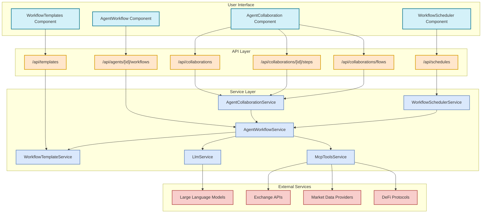
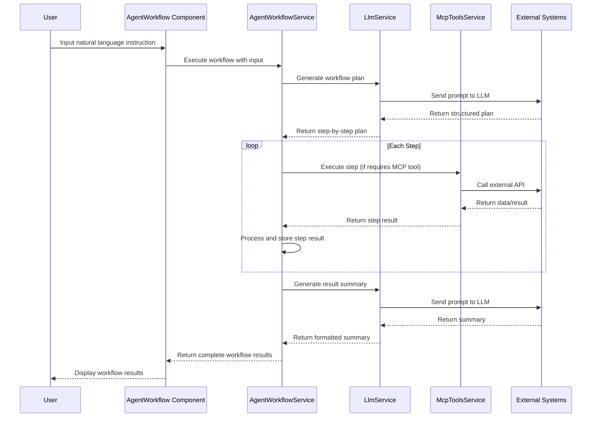
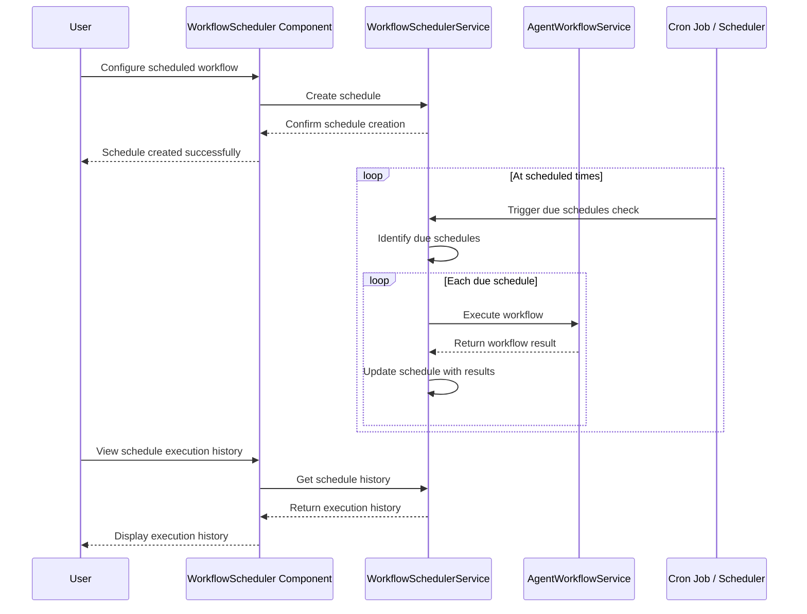
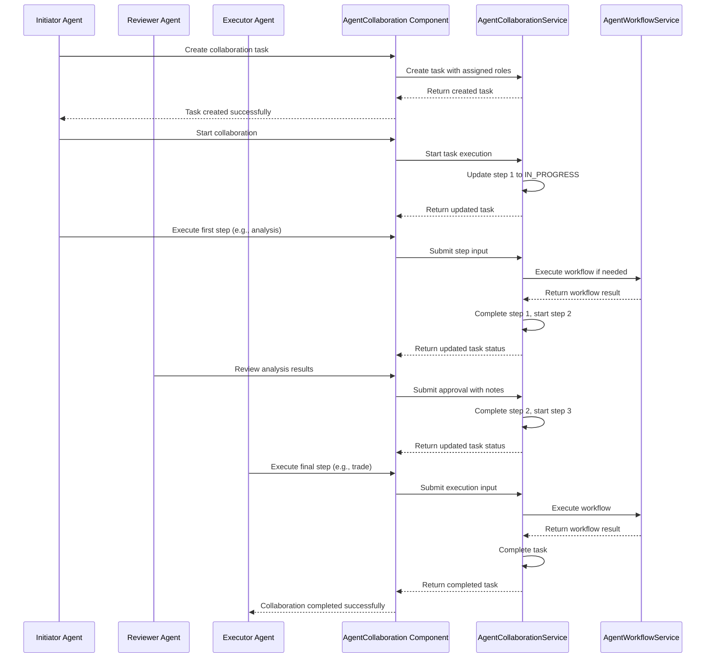
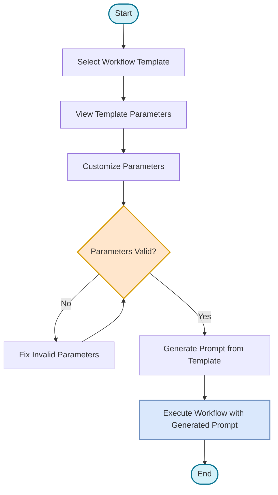
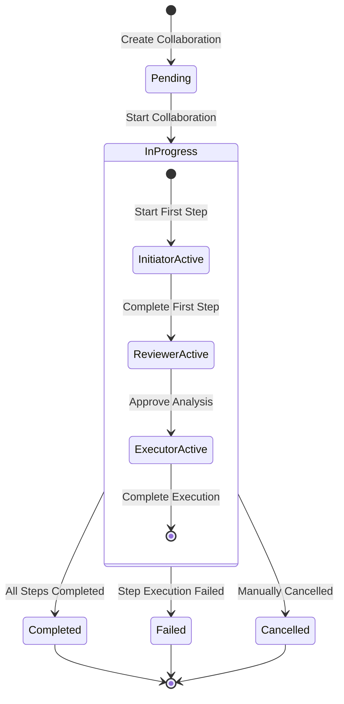
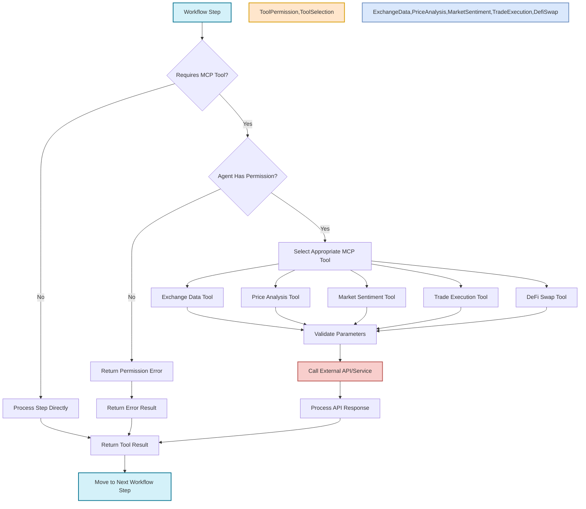

# Agent Workflow System Architecture and Processes

This document contains diagrams illustrating the architecture and processes of the GWDS Agent Workflow System.

## System Architecture

## Workflow Execution Process

## Scheduled Workflow Process

## Collaboration Workflow Process

## Template Selection and Customization

## Agent Role and Status Transitions

## LLM Processing Flow

```mermaid
flowchart LR
    Input[User Input] --> Parsing[Parse & Extract Parameters]
    Parsing --> PromptEng[Prompt Engineering]
    PromptEng --> LLMCall[Call LLM API]
    LLMCall --> ResponseParsing[Parse LLM Response]
    ResponseParsing --> StructuredPlan[Structured Execution Plan]
    StructuredPlan --> Execution[Execute Plan Steps]
    Execution --> ResultsCollection[Collect Step Results]
    ResultsCollection --> SummaryPrompt[Create Summary Prompt]
    SummaryPrompt --> LLMSummary[Call LLM for Summary]
    LLMSummary --> FinalSummary[Final Summary]
    
    subgraph "LLM Processing"
        PromptEng
        LLMCall
        ResponseParsing
        SummaryPrompt
        LLMSummary
    end
    
    style LLM Processing fill:#f9d4f1,stroke:#8f0572,stroke-width:2px
    style Input fill:#d4f1f9,stroke:#05728f,stroke-width:2px
    style FinalSummary fill:#d4f1f9,stroke:#05728f,stroke-width:2px
```

## MCP Tool Integration Flow

